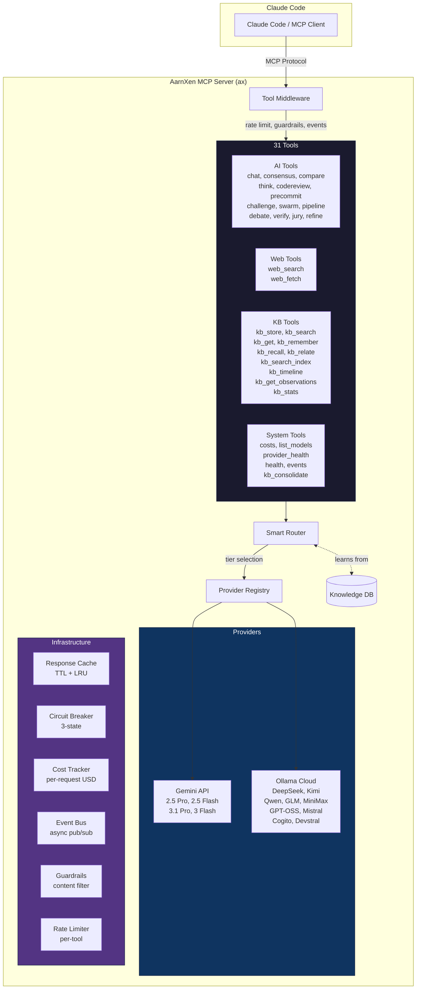
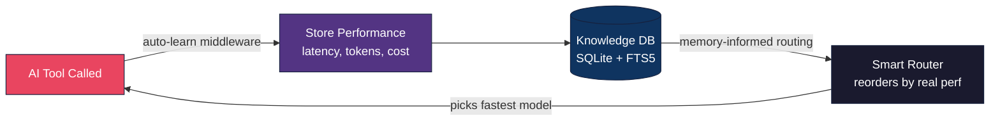
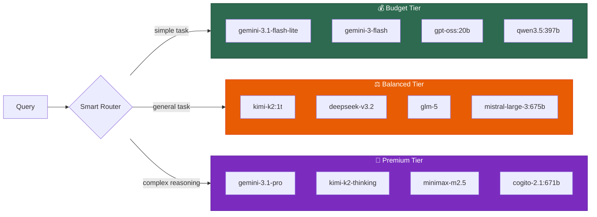
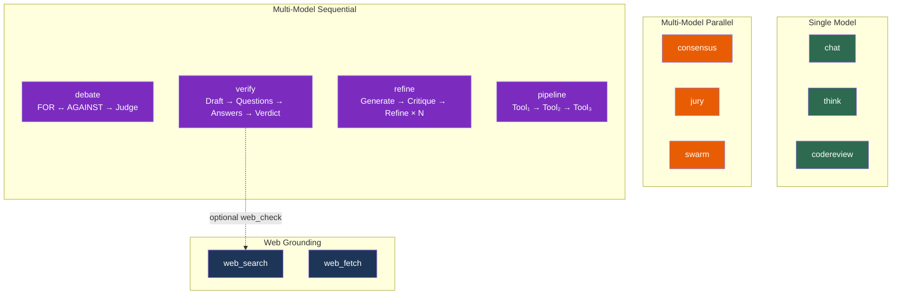
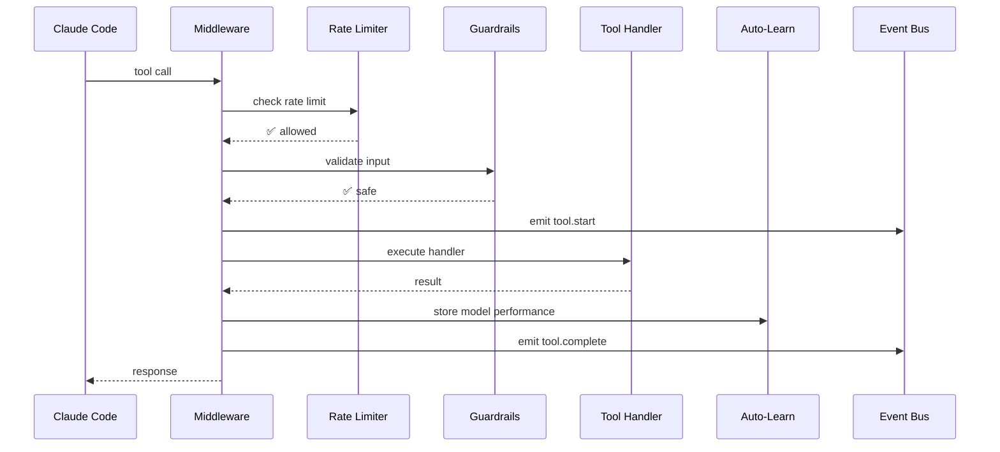

<p align="center">
  <h1 align="center">⚡ AarnXen Multi-AI MCP Server</h1>
  <p align="center">
    <strong>The most powerful multi-model AI orchestration server for Claude Code</strong>
  </p>
  <p align="center">
    <a href="#quick-start">Quick Start</a> •
    <a href="#tools">31 Tools</a> •
    <a href="#models">25+ Models</a> •
    <a href="#architecture">Architecture</a> •
    <a href="#memory-flywheel">Memory Flywheel</a>
  </p>
</p>

<p align="center">
  
  
  
  
  
</p>

---

## What is AarnXen?

AarnXen (`ax`) is a **multi-model AI orchestration MCP server** that gives Claude Code access to 25+ AI models across multiple providers. It goes beyond simple chat — it provides **adversarial debate**, **chain of verification**, **jury voting**, **self-refinement**, **web grounding**, and a **persistent knowledge base** that learns from every interaction.

No other MCP server combines multi-model orchestration patterns with persistent memory and production infrastructure.

### Key Differentiators

| Feature | PAL (11k⭐) | AI Counsel | **AarnXen** |
|---------|-------------|------------|-------------|
| Models | 5 providers | 2 models | **25+ models, 2 providers** |
| Consensus | Sequential | ❌ | **Parallel `asyncio.gather`** |
| Debate | ❌ | ✅ | **✅ + Judge synthesis** |
| Verification | ❌ | ❌ | **✅ Chain of Verification** |
| Jury Voting | ❌ | ❌ | **✅ N-model scoring** |
| Self-Refine | ❌ | ❌ | **✅ Iterative improvement** |
| Web Search | ❌ | ❌ | **✅ DuckDuckGo + AI summary** |
| Knowledge Base | ❌ | ❌ | **✅ SQLite + FTS5** |
| Auto-Learning | ❌ | ❌ | **✅ Memory flywheel** |
| Cost Tracking | ❌ | ❌ | **✅ Per-request USD** |
| Circuit Breaker | ❌ | ❌ | **✅ 3-state sliding window** |
| Guardrails | ❌ | ❌ | **✅ Content filtering** |
| Dashboard | ❌ | ❌ | **✅ Live web UI** |

---

## Architecture



### Memory Flywheel

The unique self-improving loop that no other MCP server has:



Every AI tool call automatically stores model performance metrics. The Smart Router queries this data to pick the fastest available model — **the system gets smarter with every interaction**.

---

## Quick Start

### Prerequisites

- Python 3.11+
- [uv](https://docs.astral.sh/uv/) (recommended) or pip
- At least one API key (Gemini free tier works great)

### Install

```bash
# Clone
git clone https://github.com/Abhishek-Kraj/AarnXen-MultiAI-MCP.git
cd AarnXen-MultiAI-MCP

# Install (pick one)
uv sync                              # recommended
pip install -e .                      # alternative

# Configure
mkdir -p ~/.aarnxen
cp config.example.yaml ~/.aarnxen/config.yaml
# Edit config.yaml — add your API keys

# Verify
uv run pytest tests/ -q              # 269 tests should pass
```

### Add to Claude Code

**Option A — CLI (recommended):**

```bash
claude mcp add ax -s user -- uv --directory /path/to/AarnXen-MultiAI-MCP run ax
```

**Option B — Manual config** (`~/.claude/settings.json`):

```json
{
  "mcpServers": {
    "ax": {
      "command": "uv",
      "args": ["--directory", "/path/to/AarnXen-MultiAI-MCP", "run", "ax"],
      "env": {
        "GEMINI_API_KEY": "your-gemini-key",
        "OLLAMA_CLOUD_KEY": "your-ollama-cloud-key"
      }
    }
  }
}
```

> **Tip:** The server registers as `ax` — all tools appear as `mcp__ax__chat`, `mcp__ax__consensus`, etc.

---

## Tools

### AI Orchestration Tools (15)

| Tool | Description | Pattern |
|------|-------------|---------|
| `chat` | Chat with any single AI model | Single model |
| `consensus` | Query 3+ models in parallel, synthesize agreement | Parallel fan-out |
| `compare` | Side-by-side A/B comparison of two models | A/B test |
| `think` | Deep step-by-step reasoning (light/medium/deep) | Chain of Thought |
| `codereview` | Code review (general/security/performance/bugs) | Expert analysis |
| `precommit` | Pre-commit review with PASS/FAIL verdict | Gate check |
| `challenge` | Devil's advocate — argues against your position | Adversarial |
| `swarm` | Break task into sub-tasks, run in parallel | Fan-out/fan-in |
| `pipeline` | Chain multiple tools sequentially | Sequential chain |
| `debate` | Two models argue opposing sides + judge verdict | Adversarial debate |
| `verify` | Chain of Verification — fact-check with evidence | CoVe (4-step) |
| `jury` | N models independently score content (1-10) | Voting ensemble |
| `refine` | Generate → critique → refine for N iterations | Self-Refine |
| `web_search` | DuckDuckGo search with optional AI summary | Web grounding |
| `web_fetch` | Fetch URL as markdown (Jina Reader + fallback) | Web grounding |

### Knowledge Base Tools (10)

| Tool | Description |
|------|-------------|
| `kb_store` | Store an observation about an entity |
| `kb_search` | Full-text search across all observations |
| `kb_get` | Get all observations for a specific entity |
| `kb_remember` | Quick natural-language memory storage |
| `kb_recall` | Recall memories by topic |
| `kb_relate` | Create a relationship between two entities |
| `kb_search_index` | Lightweight search returning IDs only (~50 tokens/result) |
| `kb_timeline` | Get temporal context around a specific observation |
| `kb_get_observations` | Fetch full details for specific observation IDs |
| `kb_stats` | Knowledge base statistics |

### System Tools (6)

| Tool | Description |
|------|-------------|
| `costs` | Session cost summary with per-model breakdown |
| `list_models` | List all available models across providers |
| `provider_health` | Provider status and latency metrics |
| `health` | Overall server health check |
| `events` | Recent event log (filtered by type) |
| `kb_consolidate` | Consolidate and deduplicate KB entries |

---

## Models

### Gemini (Native API)

| Model | Type | Context |
|-------|------|---------|
| `gemini-3.1-pro-preview` | Premium reasoning + code | 1M tokens |
| `gemini-3-flash-preview` | Fast balanced | 1M tokens |
| `gemini-2.5-pro` | Stable premium | 1M tokens |
| `gemini-2.5-flash` | Stable fast | 1M tokens |
| `gemini-2.5-flash-lite` | Ultra-fast budget | 1M tokens |

### Ollama Cloud (20+ models, free)

| Model | Params | Context |
|-------|--------|---------|
| `deepseek-v3.2` | 671B | 128K |
| `kimi-k2:1t-cloud` | 1T | 256K |
| `kimi-k2.5` | — | 128K |
| `kimi-k2-thinking` | — | 128K |
| `qwen3.5:397b-cloud` | 397B | 128K |
| `qwen3-coder-next:latest` | — | 128K |
| `qwen3-next:80b-cloud` | 80B | 128K |
| `qwen3-vl:235b-cloud` | 235B | 256K |
| `glm-5` | — | 128K |
| `glm-4.7` | — | 128K |
| `minimax-m2.5` | — | 128K |
| `minimax-m2` | — | 128K |
| `cogito-2.1:671b-cloud` | 671B | 128K |
| `devstral-2:123b-cloud` | 123B | 128K |
| `devstral-small-2:24b-cloud` | 24B | 128K |
| `mistral-large-3:675b-cloud` | 675B | 256K |
| `deepseek-v3.1:671b-cloud` | 671B | 128K |
| `gpt-oss:20b-cloud` | 20B | 128K |
| `gpt-oss:120b-cloud` | 120B | 128K |

> All Ollama Cloud models are **free** — no API cost. The Smart Router prioritizes them for budget-tier tasks.

### Smart Routing Tiers



---

## Usage Examples

### Basic Chat
```
"Use ax chat to ask gemini-2.5-flash about Python async patterns"
```

### Multi-Model Consensus
```
"Use ax consensus to get opinions from 3 models on microservices vs monolith"
```

### Adversarial Debate
```
"Use ax debate with topic='Is Rust better than Go for backend services?' rounds=3"
```

### Fact Verification
```
"Use ax verify with claim='Python is the most popular programming language' web_check=true"
```

### Jury Evaluation
```
"Use ax jury to score this code with criteria=code and num_jurors=5"
```

### Self-Refine
```
"Use ax refine with prompt='Write a Redis connection pool in Python' iterations=3"
```

### Code Review
```
"Use ax codereview with focus=security on this authentication handler"
```

### Pre-Commit Check
```
"Use ax precommit to review my staged changes"
```

### Web Research
```
"Use ax web_search for 'best practices for MCP server development'"
"Use ax web_fetch url='https://docs.anthropic.com/en/docs/agents-and-tools/mcp'"
```

### Knowledge Base
```
"Use ax kb_remember 'Always use connection pooling for PostgreSQL in production'"
"Use ax kb_recall 'PostgreSQL'"
"Use ax kb_search 'database optimization'"
```

### Pipeline (Chain Tools)
```
"Use ax pipeline with steps:
  1. web_search for 'Python GIL changes in 3.13'
  2. think about the implications
  3. codereview on our threading code"
```

---

## Tool Interaction Patterns



---

## Configuration

### Minimal Config (`~/.aarnxen/config.yaml`)

```yaml
default_model: "auto"
default_temperature: 0.7

providers:
  - name: gemini
    api_key_env: GEMINI_API_KEY
    priority: 1
    models:
      - gemini-2.5-pro
      - gemini-2.5-flash
      - gemini-3.1-pro-preview
      - gemini-3-flash-preview

cache:
  enabled: true
  ttl_seconds: 3600

memory:
  enabled: true
  path: "~/.aarnxen/conversations.db"

cost_tracking: true
```

### Full Config with Ollama Cloud

```yaml
providers:
  - name: gemini
    api_key_env: GEMINI_API_KEY
    priority: 1
    models:
      - gemini-3.1-pro-preview
      - gemini-3-flash-preview
      - gemini-2.5-pro
      - gemini-2.5-flash
      - gemini-2.5-flash-lite

  - name: ollama-cloud
    base_url: "https://ollama.com"
    api_key_env: OLLAMA_CLOUD_KEY
    priority: 2
    models:
      - deepseek-v3.2
      - kimi-k2:1t-cloud
      - kimi-k2.5
      - kimi-k2-thinking
      - qwen3.5:397b-cloud
      - glm-5
      - minimax-m2.5
      # ... see config.example.yaml for full list
```

---

## Dashboard

AarnXen includes a **zero-dependency web dashboard** that auto-starts with the MCP server.

```
http://localhost:8765
```

Features:
- Live model status and latency
- Cost tracking per model/provider
- Event stream viewer
- Knowledge base statistics

Run standalone: `aarnxen-dashboard` or `ax` (dashboard starts automatically)

---

## Infrastructure

### Middleware Pipeline

Every tool call passes through the middleware stack:



### Circuit Breaker

3-state circuit breaker protects against provider outages:

```
CLOSED → (3 failures) → OPEN → (30s cooldown) → HALF_OPEN → (1 success) → CLOSED
                                                            → (1 failure) → OPEN
```

### 3-Layer KB Search

Optimized for token efficiency:

| Layer | Tool | Tokens/Result | Use |
|-------|------|---------------|-----|
| 1 | `kb_search_index` | ~50 | Get IDs, scan titles |
| 2 | `kb_timeline` | ~200 | Context around an ID |
| 3 | `kb_get_observations` | Full | Fetch specific IDs |

**10x token savings** vs fetching everything upfront.

---

## Development

```bash
# Install dev dependencies
uv sync --group dev

# Run tests
uv run pytest tests/ -q                    # all 269 tests
uv run pytest tests/test_router.py -q      # specific module
uv run pytest tests/ -q -x                 # stop on first failure

# Run server locally
uv run ax

# Run dashboard standalone
uv run aarnxen-dashboard
```

### Project Structure

```
src/aarnxen/
├── server.py              # FastMCP server + tool registration
├── config.py              # YAML config loader
├── dashboard.py           # Web dashboard (auto-starts)
├── core/
│   ├── router.py          # Smart 3-tier routing + memory-informed
│   ├── tool_middleware.py  # Rate limit, guardrails, events, auto-learn
│   ├── knowledge.py       # SQLite + FTS5 knowledge base
│   ├── circuit_breaker.py # 3-state circuit breaker
│   ├── events.py          # Async event bus
│   ├── guardrails.py      # Content filtering
│   ├── rate_limit.py      # Per-tool rate limiting
│   ├── cost.py            # USD cost tracking
│   ├── cache.py           # TTL + LRU response cache
│   ├── retry.py           # Exponential backoff + fallback
│   ├── conversation.py    # Persistent conversation memory
│   ├── extractor.py       # Entity extraction
│   └── validation.py      # Input validation
├── providers/
│   ├── registry.py        # Provider registry + model resolution
│   ├── base.py            # Base provider interface
│   ├── gemini.py          # Google Gemini (native SDK)
│   ├── ollama.py          # Ollama Local + Cloud
│   └── openai_compat.py   # OpenAI-compatible endpoints
├── tools/
│   ├── chat.py            # Single model chat
│   ├── consensus.py       # Parallel multi-model
│   ├── compare.py         # A/B comparison
│   ├── think.py           # Deep reasoning
│   ├── codereview.py      # Code review
│   ├── precommit.py       # Pre-commit gate
│   ├── challenge.py       # Devil's advocate
│   ├── debate.py          # Adversarial debate
│   ├── verify.py          # Chain of Verification
│   ├── jury.py            # N-model jury voting
│   ├── refine.py          # Self-Refine
│   ├── web_search.py      # DuckDuckGo search
│   ├── web_fetch.py       # URL → markdown
│   ├── swarm.py           # Parallel sub-tasks
│   └── pipeline.py        # Sequential tool chain
└── pricing/
    └── models.py          # Per-model pricing data
```

---

## Branches

| Branch | Status | Description |
|--------|--------|-------------|
| `main` | Stable | Production-ready releases |
| `develop` | Active | Latest features (31 tools, 25+ models, memory flywheel) |

---

## License

MIT — see [LICENSE](LICENSE)

---

<p align="center">
  <strong>Built by <a href="https://github.com/Abhishek-Kraj">Abhishek</a></strong><br/>
  <sub>Making AI orchestration accessible, powerful, and self-improving.</sub>
</p>
